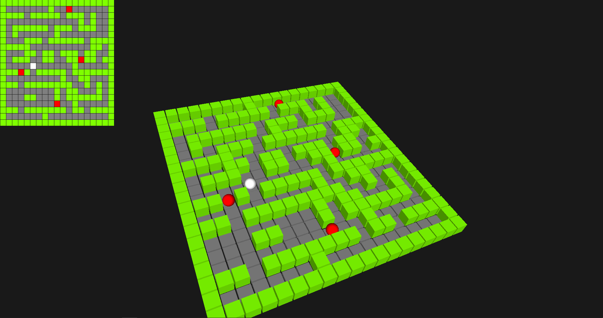

# T24LAB3D: Simple labyrinth 3D game
Last code update: 05.11.2021

This project is 3D game in which player need to pass through a labyrinth, avoiding enemies. Scene is rendered using GLUT. Labyrinth's map is set with the map.lab file (where '*' - wall, 'e' - enemy, 'a' - avatar). 

